# 计算机视觉--目标检测篇

## 1、前言 ##

图片任务三大层次：分类、检测、分割，本篇主要介绍目标检测

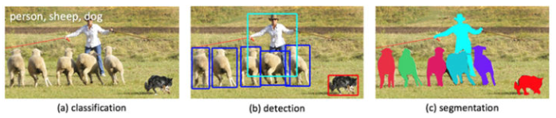
**分类：**
--用事先确定好的类别来描述图片，即将图像结构化为某一类别的信息
**检测：**
--同时获取检测目标的类别信息和位置信息
**分割：images/**
--根据某些规则把图片中的像素分成不同部分

### 1.1 名称解释

#### 1.1.1 IOU（交并比）

Intersection over Union

模型产生的候选框和原标记框的重叠率，或者说是它们的交集和并集的比值，越大越好，最大为1
IOU = (A和B交集)/(A和B并集)

#### 1.1.2 mAP（平均精度均值）

Mean Average Precision

Precision = 正确划分为正例的个数 / （正确划分为正例的个数 + 错划分为正例的个数）
Recall = 正确划分为正例的个数 / （正确划分为正例的个数 + 错分为负例的个数）
在目标检测中，每一类都可以根据recall和precision绘制P-R曲线，AP就是该曲线下的面积，mAP就是所有类AP的平均值

#### 1.1.3 NMS（非极大抑制）

Non-Maximum Suppression

目标检测中，NMS被用来清除多余的定位框，找到最佳的物体检测位置
场景：定位P图中的目标G,最后算法找到一堆可能是目标G的方框，此时我们需要判别哪些矩形框是没用的，这时就要用到非极大抑制NMS
做法：
先假设有6个矩形框，将框框根据分类器中判定此物体是G的概率做排序，从大到小分别为A、B、C、D、E、F。

（1）从概率最大的框框A开始，分别判断B~F与A框的交并比IOU是否大于某个设定的阈值
（2）假设B、E与A框的IOU超过阈值，丢掉B、E，标记并保留第一个矩形框A
（3）从剩下的C、D、F中，选择概率最大的C，然后判断C与D、F的交并比IOU，IOU大于一定阈值的就丢掉，标记C是我们保留下来的第二个矩形框
（4）如此重复，找到所有被保留下来的矩形框。

#### 1.1.4 ROI（感兴趣区域）

regions of interest

ROI指的是利用selective search或其它算法得到的候选框在feature map上的映射（位置），ROI pooling是为了保证每个区域的尺寸相同

#### 1.1.5 FPS（每秒帧数）

frames per second

FPS是指1s时间里传输图片的量，也可以理解为图形处理器每秒能够刷新的次数

### 1.2 通用数据集介绍 ###

#### 1.2.1 PASCAL VOC~2G

这个数据集常用于物体检测、分割，包含20个类别。
VOC2007包含9963张标注过的图片，由train/val/test三部分组成，共标出24640个物体
VOC2012对于检测任务，trainval有11540张图片共27450个物体

VOC2012对于分割任务，trainval包含2913张图片共6929个物体

VOC数据集格式如下

```
VOCdeckit
  └── VOC2012   #不同年份的数据集，以2012为例，还有2007等其它年份的
       ├── Annotations	#存放xml文件，与JPEGImages中图片一一对应，包含来源、图形尺寸以及包含哪些目标及目标信息等
       ├── ImageSets	#存放txt文件，txt文件中每一行包含一个图片的名称，末尾会加上±1表示正负样本
       │     ├── Action	#存放的是人的动作（如running、jumping等）
       │     ├── Layout	#存放的是具有人体部位的数据（人的head、hand、feet等）
       │     ├── Main	#存放图像物体识别20个类别的train、val、trainval等txt
       │     └── Segmentation	#存放用于分割的数据
       ├── JPEGImages	#存放原始图片
       ├── SegmentationClass	#存放图像分割后的效果图，与JPEGImages中图片一一对应，图片像素颜色共20种，对应20类物体
       └── SegmentationObject	#存放图像分割后的效果图，与JPEGImages中图片一一对应。与Class中图片的区别在于：在Class里，一张图片如果有多架飞机，则全部标注为红色，在Object里，同张图片的飞机会被不同颜色标注出来
```

#### 1.2.2 COCO~40G

这个数据集常用于物体检测、分割，包含91类目标，328,000影像和2,500,000个label。

COCO数据集现有3种标注类型：object instances（目标实例），object keypoints（目标上的关键点），image captions（看图说话），使用JSON文件存储。images/

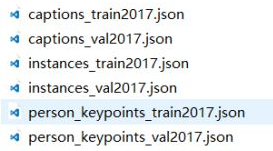

## 2、目标检测 ##

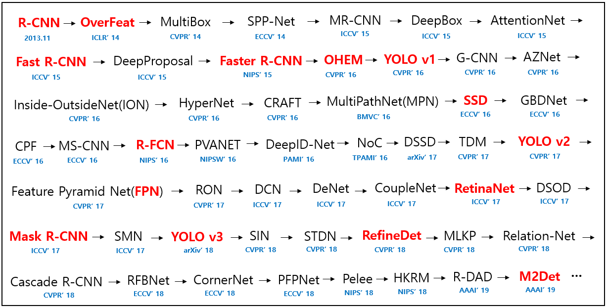

纵观2013-2019年，目标检测新模型层出不穷，性能越来越好！以下介绍近期我学习的一些模型：R-CNN,Fast R-CNN,Faster R-CNN,YOLO,SSD（代码跟着Github大牛跑了Faster R-CNN、YOLO-v3)。

截至目前，比较流行的算法分为两类：

- two-stage：

先用启发式方法（SS）或者RPN网络产生Region Proposal（候选区域），然后再在Region Proposal 上做分类与回归。算法可能准确度会高一些，但是速度慢

> 常见算法有R-CNN、SPP-Net、Fast R-CNN、Faster R-CNN和R-FCN等

- one-stage：

仅使用一个网络直接预测不同目标的类别与位置。算法速度快，但是准确性可能低一些，适合做准确性要求不高的视频检测

> 常见的算法有OverFeat、YOLOv1、YOLOv2、YOLOv3、SSD和RetinaNet等

### 2.1 R-CNN（the first paper） ###

R-CNN的想法直接明了，即将检测任务转化为区域上的分类任务，是深度学习方法在检测任务上的试水。

> 缺点：需要训练三个不同的模型（proposal, classification, regression）、速度慢、要求内存大。

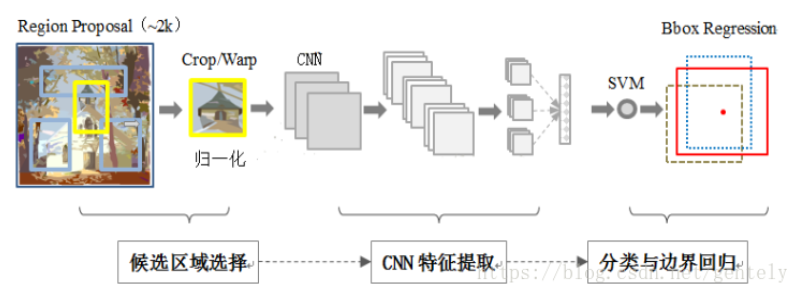
具体实现流程：

#### 2.1.1 候选区域选择--候选框 ####

通过selective search算法，每张图片检测约2k个矩形候选框（region proposal）

**selective search算法介绍**

1、使用一种过分割手段，将图像分成很多小区域，生成区域集R
2、初始化一个相似集合为空集：S
3、计算区域集R中每个相邻区域的相似度（包括颜色、纹理、尺寸、交叠），放入集合S中，集合S保存的其实是一个区域对以及它们之间的相似度
4、找出S中相似度最高的区域对，将其合并为新区域，并从S中删除与它们相关的所有相似度和区域对。重新计算这个新区域与周围区域的相似度，放入集合S中，并将这个新合并的区域放入集合R中。重复这个步骤直到S为空
5、从R中找出所有区域的bounding box（即包围该区域的最小矩形框），这些box就是候选框

#### 2.1.2 CNN特征提取 ####

对于每个候选框，用摘掉了最后一层softmax层的AlexNet（当时分类表现最好的分类网络）来提取特征

- CNN输入--候选框大小统一固定

由SS算法获取的候选框大小不一，但CNN要求输入图片的大小是固定的（227*227），因而在特征提取之前要把候选框都缩放到固定的大小。

- 删减无用候选框

2k个候选框，数量太多且很多是无用的框，考虑怎么删减。
实际每张图片只标注了正确的bounding-box，且我们检测出的这2k个矩形框一般不会出现和人工标注框完全一致的候选框，可用IOU为这2k个bounding box打标签（候选框与物体的人工标注矩形框的IOU大于0.5，则把这个候选框标注成物体类别，否则把它标为背景类别），减少要训练的候选框

- 监督训练样本紧缺，考虑在其它数据上预训练，之后微调（fine-tuning）

将Alexnet网络训练Imagenet数据集得到的模型作为基网络，再在检测问题上进行微调（fine-tuning），得到特征数据。假设要检测的物体类别有N类，那么就需要将预训练阶段CNN模型的最后一层f8换掉，替换成N+1个输出的神经元（+1是背景类），然后这一层直接采用参数随机初始化的方法，其它网络层的参数不变，接着开始梯度下降训练。

**Alexnet结构图**

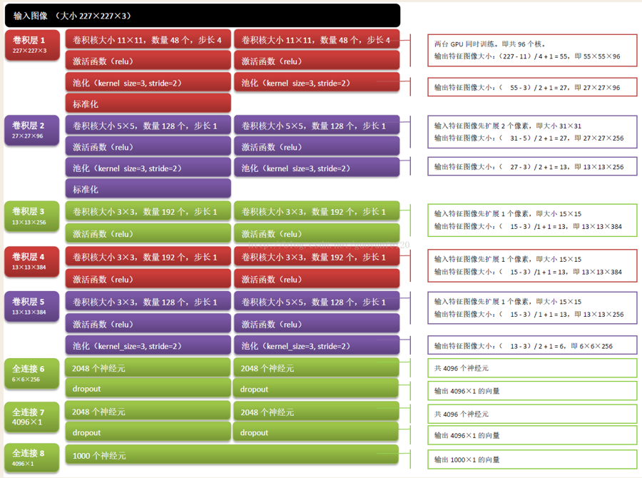

#### 2.1.3 SVM分类 ####

这是一个二分类的问题。每个类别对应一个SVM分类器，判断是不是属于这个类别。
SVM分类后，对每个类别用NMS来舍弃一部分region（避免结果冗余），得到detection的结果。经过测试（穷举逼近设置IOU-->0.1,0.2,0.3,0.4,0.5)发现IOU阈值设为0.3时效果最好。

#### 2.1.4 boundingbox位置回归 ####

对每一类目标，使用一个线性脊回归器进行位置修正。
**为何修正**：当时将候选框固定成同一大小时进行了缩放（加了一个16像素宽的padding），故而出来的detection bbox是有偏差的，做regression刚好可以修正这一情况。
**输入**：cnn中的f7层的4096维特征
**输出**：xy方向的缩放和平移
**训练样本**：判定为本类的候选框中，和实际人工标注框的IOU大于0.6的候选框

<font color=red size=4>Q1：闲着没事干么？特意用去掉softmax分类层的CNN做特征提取，然后再把提取的特征用svm进行类别分类</font>
事情是这样的（说白了，准确率至上）：
1、cnn在训练的时候，对训练数据做了比较宽松的标注(IOU只要大于0.5都被标注为正样本)，比如一个bounding box可能只包含物体的一部分，但也把它标注为正样本，用于训练cnn；采用这个方法的主要原因在于CNN容易过拟合，需要大量的训练数据
2、svm训练的时候，对于训练样本数据的IOU要求比较严格，我们只有当bounding box把整个物体都包含进去了，我们才把它标注为物体类别，然后训练svm；这样做是因为SVM适用于少样本训练

### 2.2 Fast R-CNN ###

R-CNN每张图片要选2k个左右的候选框，符合条件的候选框都要进行CNN训练，耗时占资源，一张图片40-50s
**优化**：可不可以每张图片只运行一次CNN，而不是辣么多次？

<font color=red size=3>相比R-CNN改变：</font>

（1）一张图片只做一次CNN特征提取

（2）用ROI pooling来固定bbox大小

（3）SVM改为softmax
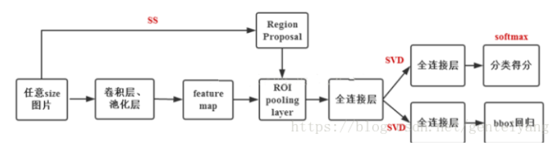

具体流程如下：

1、用CNN一次性提取一整张图片的特征图feature map

2、用SS在原始图片提取2k个候选框bbox

3、根据feature map与原始图片的比例关系、bbox的映射关系，把2k个候选框映射到feature map，然后再从feature map中裁剪出相应的感兴趣区域ROI

4、ROI pooling--把ROI调整到固定尺寸

5、之后将这些区域传递到一个全连接的网络中，并用softmax和线性回归层同时返回类别和边界框


### 2.3 Faster R-CNN（State of the Art） ###

Fast R-CNN每张图片2~3s，还是比较耗时，这主要是SS算法提取候选框耗时，且和CNN、SVM都是分开训练的，不是端到端
**优化**：换一个快点的候选框提取算法，实现端到端？

<font color=red size=3>相比Fast R-CNN改变：</font>

（1）将SS换成RPN网络提取候选框

（2）候选框生成、特征提取、类别分类、bbox回归全部交给神经网络来做

用局部网络RPN（region proposal networks）来提取候选框，Faster R-CNN每张图片0.2s
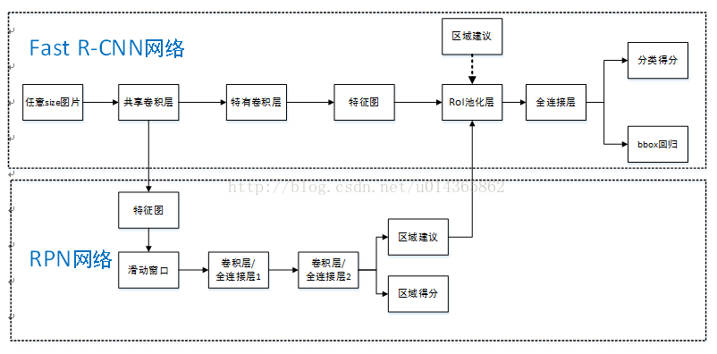

#### 2.3.1 RPN提取候选框 ####

RPN是全卷积神经网络，其中全为卷积层，无全连接层

- 网络输入

经过共享卷积层AlexNet conv5，得到一系列特征图图片（height,width,256），因输入是任意大小的图片，所以输出特征图大小也不固定。

- 网络输出

RPN网络将每个样本映射为标签的得分score和四个坐标值(yes,no,x1,x2,y1,y2)，标签值反应这个anchor box是否有物体，四个坐标值用于定义物体的位置。

- 网络结构

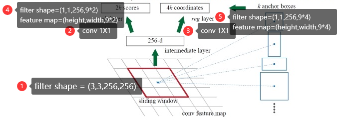

针对最后一个共享卷积层的 feature map，采用一个小网络对其平滑。该小网络全连接到输入conv feature map的一个3\*3的空间窗口。卷积层后接ReLU层，每个滑窗被映射到一个低维向量256-d，低维向量被输入到两个并列的1X1的卷积层--边界框回归层reg和边界框分类层cls。

- 9个固定的bbox--每个滑窗有9个anchors

上图那k个固定的bbox被称之为anchors。每个anchor位于滑动窗口（sliding window--3\*3大小）的中心，对应映射到原始图片的3个不同大小，3种不同的长宽比。前三个图形是对应3种不同长宽比；第1个图形和第4个图形是不同的大小。这样经过共享卷积层，得到的特征图大小是W\*H,就等于有W\*H\*K个可能的物体框。

#### 2.3.2 共享卷积层参数训练方法 ####

训练RPN网络，然后根据其输出的检测bbox，训练Fast R-CNN，之后再用训练好的Fast R-CNN初始化RPN，继续RPN训练，如此交替迭代。具体训练步骤：

（1）采用预训练好的ImageNet，来初始化RPN网络，然后对RPN进行微调训练
（2）根据上步训练好的RPN来检测物体bbox，然后单独训练Fast R-CNN，需要注意的是，这一步在训练的时候，两个网络是完全独立分开的，不存在共享网络层；Fast R-CNN的参数初始化也是采用ImageNet训练好的模型
（3）采用Fast R-CNN训练好的网络参数，来重新初始化RPN的共享卷积层参数，然后对RPN局部网络进行微调。值得注意的是，在这一步共享卷积层的参数没有进行更新迭代，从Fast R-CNN训练好后，就被固定死了，只对RPN局部网络进行微调
（4）继续固定住共享网络参数层，用上一步的RPN网络提取的bbox对Fast R-CNN的非共享网络层进行参数微调。

#### 2.3.3 anchors选择 ####

对于anchors，选择3种不同大小，面积分别为(128^2,256^2,512^2)，以及3种不同的长宽比1:1,1:2,2:1。对于一张1000\*600的输入图片，这样差不多有2w个固定的anchors（60\*40\*9）。

在训练阶段，若anchors超过原始图片边界，忽略此anchor，如此，还剩6000左右anchor。在测试阶段，对于超过边界的bbox，可以把bbox裁剪到图片边界。

对于经过RPN提取过的矩形框，仍可以采用NMS算法删除重叠的矩形框，设置IOU阈值为0.7，最后剩下检测框大约2k个。在经过NMS筛选后，根据bbox是否有物体的概率值继续排序，挑选出最大的N（类别数）个，作为ROI pooling网络层输入。在训练阶段，用NMS筛选剩下的2k个进行训练，测试阶段输出ROI层的bbox视具体情况而定。

### 2.4 YOLO ###

YOLO 的表现一般要优于 DPM、R-CNN，它更能适应新的领域，由于其是高度可推广的，即使有非法输入，也不太可能崩溃，泛化能力很强。最大特点是快，快，快！！！

YOLO 的 background errors（背景错误--将背景的一小块看成是物体） 比 Fast R-CNN 少一半多。但是YOLO对小对象检测效果不太好（尤其是一些聚集在一起的小对象），总体预测精度略低于Fast R-CNN。主要是因为网络设置比较稀疏，且每个网格只预测两个（论文中，可改）边框，另外Pooling层会丢失一些细节信息，对定位存在影响。

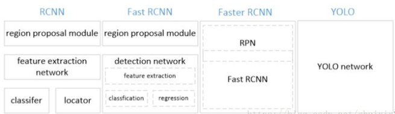

具体流程如下

#### 2.4.1 将一副图像分成S\*S个网格(grid cell) ####

将图片固定成一定大小，如448X448，然后将图片划分成SXS网格，如7X7
每个要检测物体的中心落在哪个网格，则这个网格负责检测这个物体。注意：物体的中心只有一个，故只被一个网格负责检测

#### 2.4.2 CNN提取特征和预测 ####

针对每个网格，CNN负责预测B个bounding box，每个bounding box要有5+20个预测值。"5"指位置x,y,大小w,h，置信度confidence，"20"指物体是20个类别的可能性。

> xy表示bounding box 的中心相对于网格左上角坐标偏移；wh表示相对于整张图片的宽高
> confidence被定义为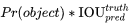
> Pr(Object)是这个bounding box含有目标的置信度，若有object落在这个网格，则取1，否则取0；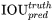是这个bounding box的预测准确度，用预测框和实际框的IOU来表征

测试的时候，每个bounding box的类别置信度得分为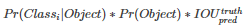
B个bounding box中对于20个类别可能性部分，数据是共享的，正因为如此，同个网格没办法预测多个目标
预测B个（论文中B=2）bounding box，一个不就够了么？--训练的时候会在线计算预测的bounding box和ground truth的IOU，IOU大的那个负责预测这个物体，如此可以提高预测精度；但是从计算量来看，B又不能太大

YOLO损失函数设计
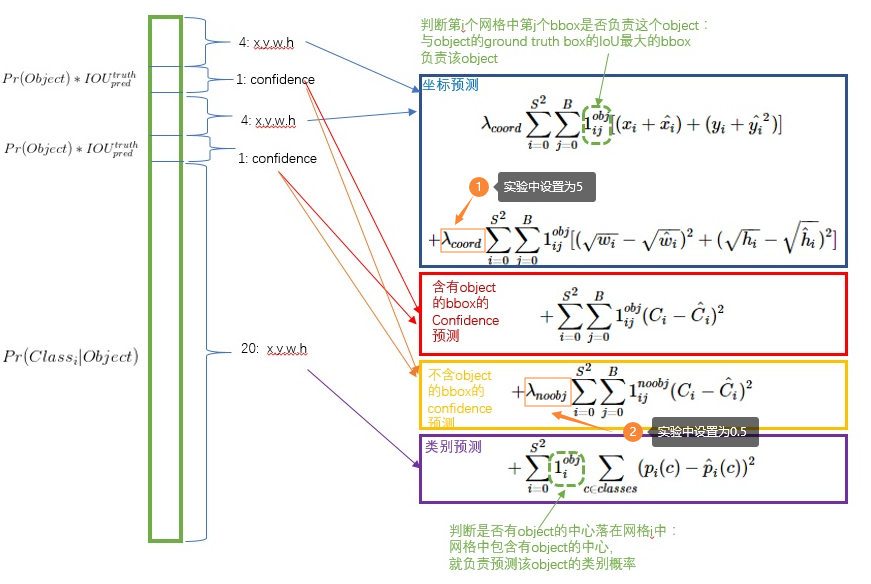

#### 2.4.3 输出结果 ####

在得到类别置信度得分之后，设置阈值，滤掉得分低的boxes，对保留的boxes进行NMS处理，最终得到检测结果


### 2.5 SSD ###

速度上，比YOLO还要快；精度上，可以和Faster RCNN媲美

#### 2.5.1 网络结构

算法的主网络结构是VGG16，其中fc6  fc7被改成卷积层，并随后增加了4个卷积层来构造网络结构。

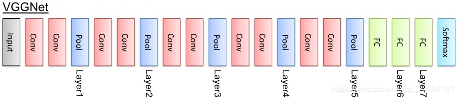

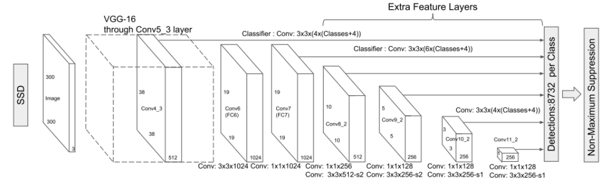

#### 2.5.2 先验框和框框的信息

SSD以Base Network（如VGG）为基础，抽取其中不同的层，利用小的卷积核去卷积不同层的feature map，产生先验框的同时预测框框的坐标、大小（cx,cy,w,h）以及对应类别的置信度（c1,c2,...,cn）

VGG16中的conv4_3层将作为检测的第一个特征图，从后面新增的卷积层提取conv7，conv8_2，conv9_2，conv10_2，conv11_2作为检测用的特征图，共提取6个特征图。其大小分别是(38,38)，(19,19)，(10,10)，(5,5)，(3,3)，(1,1)

> conv4_3层特征图大小是38\*38，但是该层比较靠前，norm较大，所以在之后增加了一个L2 Normalization层（对每个像素点在channle维度做归一化），以保证后和后面的检测层差异不是很大。

不同层的feature map尺寸不一样，尺寸随feature map层数增加线性增加，可用于产生不同尺寸的先验框，再加上同一尺寸下不同长宽比的先验框，6个feature map可以产生8732个先验框，覆盖范围非常广。

#### 2.5.3 检测

对于每个先验框：

（1）根据类别置信度确定其类别（选置信度最大的）与置信度值

（2）过滤掉属于背景的先验框

（3）根据置信度阈值（如0.5）过滤掉阈值较低的预测框

（4）对预测框进行解码，根据先验框得到其真实的位置参数（解码后一般还需要做clip，防止预测框位置超出图片）

（5）根据置信度进行降序排列，保留topk（如400）个预测框

（6）利用NMS过滤掉那些重叠度较大的预测框，最后剩余的预测框就是检测结果了

## 参考文献

https://blog.csdn.net/bestrivern/article/details/88846977

https://github.com/hoya012/deep_learning_object_detection
